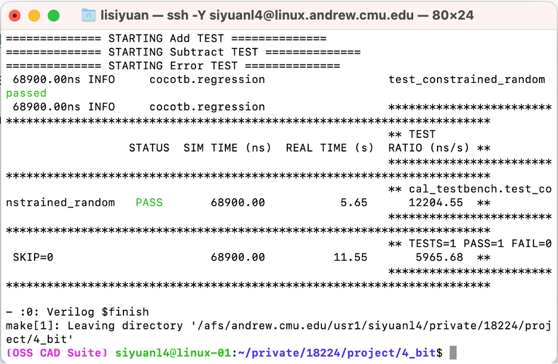

# Matrix Calculator

Siyuan Li
18-224 Spring 2024 Final Tapeout Project

## Overview

This project is a 4 by 4 matrix calculator. It can perform multiplication, addition, and subtraction. The element of input matrix is 4 bit.

## How it Works

Each number of the matrix is 4 bit. During each of the inputs, the 8 bit data will be two elements of the full matrix, and hit input enter.

The sequence of entering elements is shown below.

Matrix 1
  
00 00 01 01

02 02 03 03

04 04 05 05

06 06 07 07

Matrix 2

08 08 09 09

10 10 11 11

12 12 13 13

14 14 15 15

During entering the last two element of the second matrix, the calculation sign will also need to be selected. 00 is multiplication. 01 is addition. 10 is subtraction. 11 is an undefined behavior, which will raise an error flag in output.

Because 4 by 4 matrix with 4 bit element can result with 4 by 4 matrix with 10 bit element, the output will display the matrix element one by one, part by part. After finishing the calculation, the finish signal will be high, and the 5 bit output will be the higher 5 bit of the first element of result. Hitting the output change button, the output will switch to the lower 5 bit of the first element. Hitting the change button again, the output will switch to the higher 5 bit of the second element.

The 4 index indicator will show which element is showing right now. The index of the element is shown below.

0000 0001 0010 0011

0100 0101 0110 0111

1000 1001 1010 1011

1100 1101 1110 1111

The multiplication of whole matrix will be accomplished with 17 cycles. The multiplication of each element will be accomplished with two cycles. The first cycle will do the multiplication of corresponding elements, and the second cycle will add the corresponding element.

The addition and subtraction will be accomplished with 16 cycles. In each cycle, one element of result will be calculated.

## Inputs/Outputs

Input:

8 data, 2 calculation sign, 1 input enter, 1 output change

Output:

5 data, 1 finish, 1 error, 4 index indicator

## Hardware Peripherals

10 switches: 8 for data input, 2 for calculation sign input

2 active-high buttons: 1 for input enter, 1 for output change

11 LEDs: 5 for data output, 1 for finish, 1 for error, 4 for index indicator

## Design Testing / Bringup

Before tapeout, this project can be tested using a cocotb simulator testbench.

The file is cal_testbench.py and testbench.mk in src folder.

The tests are separated into 4 parts, multiplication, addition, subtraction, and error. Each part will focus testing on one function. At the start of each test, it will randomly generate two matrices. Then it will feed two matrices to the input. After the result is outputted, it will check it against a golden model. The golden model calculates the result using numpy library. Each of these 4 tests will run 10 times. After run all the tests, it will output the result as Pass or Fail.

After tapeout, tests will require manual inputs. Data can be inputted following the "How It Works" section.

Example Input:

Input data is 1111_1111, calculation sign is 00.

Press enter 16 times.

Example Output: 

Error is always 0.

When finish is 1, output data is 1110_0, index indicator is 0000.

Press change 1 time. Output data is 0010_0, index indicator is 0000.

Press change 1 time. Output data is 1110_0, index indicator is 0001.

Press change 1 time. Output data is 0010_0, index indicator is 0001.

.....

## MEDIA

Proof of project in action.

